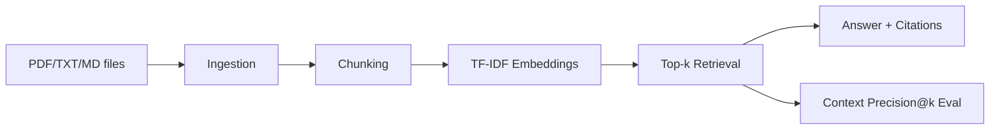

# RAG Pipeline Demo

[](https://github.com/OWNER/rag-pipeline-demo/actions/workflows/ci.yml)


> **Production-shaped RAG baseline**: ingest real PDF/text docs, chunk, embed (TF-IDF), retrieve top-k, answer with verifiable citations, and run context-precision evaluation.

## Architecture



## Quickstart (3 commands)

```bash
python -m venv .venv && source .venv/bin/activate
pip install -e '.[dev]'
rag ingest ./docs --index artifacts/rag_index.pkl && rag ask "What is our retention policy?" --index artifacts/rag_index.pkl --top-k 3 --json
```

## Features

- PDF + text ingestion (`.pdf`, `.txt`, `.md`)
- deterministic chunking with overlap
- embedding + retrieval with cosine similarity
- grounded answers with citations (`doc_id`, offsets, score, excerpt)
- simple offline eval: `context_precision@k`
- API + CLI + Docker + CI

## API

- `GET /health`
- `POST /ingest`
- `POST /ask`
- `POST /evaluate`

## Evaluation dataset format

`eval.jsonl`:

```json
{"query":"MFA required?","relevant_doc_ids":["/abs/path/security.txt"]}
```

Run:

```bash
rag evaluate --index artifacts/rag_index.pkl --dataset eval.jsonl --k 3
```

## Local quality gate

```bash
ruff check src tests
pytest -q
python -m build
```

## Docker

```bash
docker compose up --build
```

API at `http://127.0.0.1:8080/health`.
