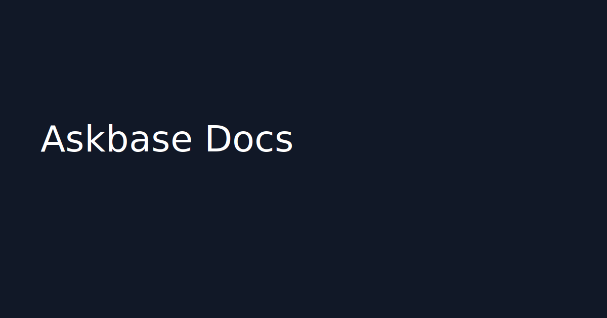

# Askbase Docs — Conversão para Astro Starlight




[](../../actions/workflows/docs-site.yml)

## Quickstart
```bash
npm ci
npm run dev
npm run build
```

## Docker
```bash
docker build -t askbase-docs:latest .
docker compose up --build
```

## Kubernetes
```bash
kubectl apply -f k8s/
```
