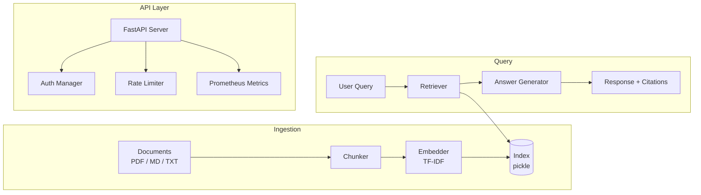

## System overview



## Pipeline stages

### 1. Ingestion

Documents go through three steps:

1. **Parsing** - Extract text from PDF (via pypdf), Markdown, or plain text files
2. **Chunking** - Split into overlapping windows (default: 220 chars, 40 char overlap). Overlap preserves context across chunk boundaries.
3. **Indexing** - TF-IDF vectorization with scikit-learn. The resulting sparse matrix and metadata get serialized to a pickle file.

The chunker handles edge cases like empty documents, single-character files, and very long lines. Chunk boundaries snap to sentence ends when possible.

### 2. Retrieval

When a query comes in:

1. The query gets vectorized using the same TF-IDF vocabulary
2. Cosine similarity scores are computed against all chunks
3. Top-k chunks are returned, ranked by relevance score

### 3. Answer generation

Retrieved chunks are assembled into a grounded answer. Each claim maps back to a citation with:
- Source document ID
- Character offsets (start/end position in the original document)
- Relevance score
- Text excerpt

This means every answer is auditable. No hallucinated content.

### 4. Evaluation

The `evaluate` command runs context precision tests against a golden dataset. This measures how well the retrieval step surfaces the right chunks for known questions, giving you a quantitative quality signal.

## Security model

| Layer | Implementation |
|-------|---------------|
| Authentication | Bearer token with role-based access (admin/user) |
| Authorization | Role checks on sensitive endpoints (ingest, evaluate, admin) |
| Rate limiting | In-memory per-IP sliding window |
| Observability | Prometheus metrics + structured logging |

Tokens are configured via environment variables (`RAG_ADMIN_TOKEN`, `RAG_USER_TOKEN`) so they never touch source code.

## Data flow

```
User --[Bearer token]--> FastAPI
  --> Rate limiter (per-IP)
  --> Auth check (role validation)
  --> Handler (ask/ingest/evaluate)
  --> Pipeline (chunk/embed/retrieve)
  --> Response (answer + citations + rate_limit)
```

Everything runs in a single process. No external dependencies beyond Python and the files you ingest. The index is a local pickle file, so there is no database to manage.
